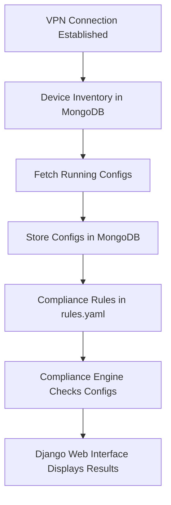

### 🔐 Network Configuration Compliance Checker

### 📌 About the Project

The **Network Configuration Compliance Checker** is a Python + Django-based tool that:

* Connects to network devices (via VPN + Netmiko/Paramiko).
* Stores device inventory and running configurations in **MongoDB**.
* Defines compliance rules (in **YAML**) for best practices (e.g., NTP, SNMP, Banners).
* Runs compliance checks against stored configs.
* Displays results in a **Django web interface**.

This tool is designed to help **network administrators & NetOps engineers** automatically validate and enforce compliance across multi-vendor network environments.

---

## 🚀 Use Case

In enterprises, misconfigured devices often lead to **security risks and outages**.

* Example: Leaving SNMP with `public`/`private` strings is a major security hole.
* Example: Missing NTP causes log/timestamp mismatches across devices.

This project ensures:
✔ Compliance with network standards
✔ Easy tracking of misconfigured devices
✔ Centralized storage of device configs
✔ Scalable rule definitions using YAML

---

## 📂 Project Structure

```
network-compliance-checker/
│── devices/                   # MongoDB collection: device inventory
│── configs/                   # MongoDB collection: configs with timestamp
│── rules.yaml                 # Compliance rules (Step E)
│── config_find.py             # Fetch + store configs in MongoDB (Step E)
│── compliance_check.py        # Run compliance check (Step F)
│── django_app/                # Django frontend (Step G)
│   ├── templates/             # HTML Templates
│   ├── views.py
│   ├── models.py
│   └── urls.py
│── requirements.txt           # Python dependencies
│── README.md                  # Project documentation
```

---

## 📊 Flow Diagram



---

## ⚙️ Step-by-Step Workflow

1. **Device Inventory (Step D.1)**

   * Add devices in MongoDB collection `devices`:

   ```json
   {
     "hostname": "R1",
     "ip": "10.10.20.30",
     "vendor": "cisco",
     "username": "admin",
     "password": "cisco123"
   }
   ```

2. **Config Storage (Step D.2)**

   * Fetch running configs using **Netmiko** and save in `configs` collection with timestamp.

3. **Compliance Rules (Step E)**

   * Define rules in `rules.yaml`:

   ```yaml
   ntp:
     must_have:
       - "ntp server"
   snmp:
     must_not_have:
       - "snmp-server community public"
   ```

4. **Compliance Check (Step F)**

   * Run Python script:

   ```bash
   python compliance_check.py
   ```

   * Results show which devices are compliant/non-compliant.

5. **Web Interface (Step G)**

   * Launch Django app:

   ```bash
   python manage.py runserver
   ```

   * Navigate to `http://127.0.0.1:8000/reports` to view results.

---

## 📦 Installation

```bash
# Clone repo
git clone https://github.com/yourusername/network-compliance-checker.git
cd network-compliance-checker

# Create virtual environment
python -m venv venv
source venv/bin/activate   # (Linux/Mac)
venv\Scripts\activate      # (Windows)

```

---

## 🛠️ Tech Stack

* **Python 3.x**
* **Netmiko / Paramiko** → Device connection
* **MongoDB** → Inventory + Config storage
* **PyYAML** → Compliance rules
* **Django** → Web frontend

---

## 📌 Example Output (CLI)

```
Checking compliance for R1...
✔ Rule Passed: NTP server configured
❌ Rule Failed: SNMP must not use default public strings
✔ Rule Passed: MOTD banner present
```

---

## 🖥️ Example Output (Web UI)

* Device list with compliance status:

  * ✅ Compliant
  * ❌ Non-Compliant
* Drill-down: See **which rule failed**.

---

## 👨‍💻 Contributors

* **Merwin Jaya Ganesh** (Project Developer)
